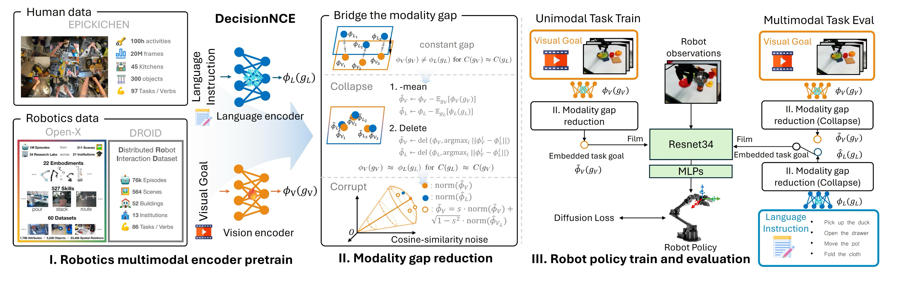

# 
Robo-MUTUAL: Robotic Multimodal Task Specification via Unimodal Learning

    
    

        The official implementation of "Robo-MUTUAL: Robotic Multimodal Task Specification via Unimodal Learning"
    

[Paper](https://arxiv.org/) | [Project page](https://zh1hao.wang/Robo_MUTUAL/)

## 
Introduction

We propose Robo-MUTUAL (Robotic Multimodal Task specifications via Unimodal Learning). This new framework enhances the Cross-modality Alignment capability of existing multimodal encoders by consuming a broader spectrum of robot-relevant data. Specifically, we retrain DecisionNCE, a state-of-the-art robotic multimodal encoder on an all-encompassing dataset, which not only consists of large-scale robot datasets including Open-X and DROID, but also incorporates a large human-activity dataset EPICK-KITCHEN. Combined, these datasets form the most comprehensive collection to date for robotic multimodal encoder pretraining. Building on the pretrained encoders, we explore two training-free methods to bridge the modality gap within the representation space, where we further introduce an effective cosine-similarity noise to facilitate efficient data augmentation in representation space to enable generalization to new task prompts. 

    

Tested across over 130 tasks and 4000 evaluations on both simulated LIBERO environments and real robot platforms, extensive experiments showcase a promising avenue towards enabling robots to understand multimodal instructions via unimodal training.

## 
Quick Start

Code will come soon

## 
Citation

Coming soon