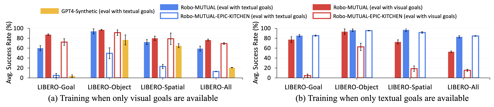
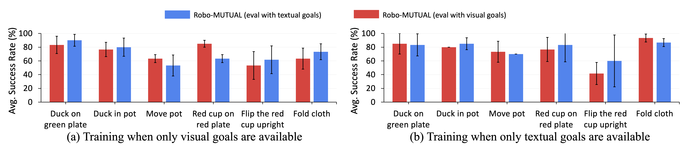

# <div align="center">Robo-MUTUAL:<br><u>Robo</u>tic <u>Mu</u>ltimodal <u>T</u>ask Specification via <u>U</u>nimod<u>al</u> Learning</div>

<div align="center">
    
    <p><span style="font-size: 24px;"><b>IEEE International Conference on Robotics and Automation (ICRA) 2025</b></span></p>
    <p>
        The official implementation of "Robo-MUTUAL: Robotic Multimodal Task Specification via Unimodal Learning", which uses unimodal data to train a multimodal robotic policy.
    </p>

[Paper](https://arxiv.org/pdf/2410.01529) | [Project page](https://zh1hao.wang/Robo_MUTUAL/)

</div>

## <div align="center">Method</div>

We propose Robo-MUTUAL (Robotic Multimodal Task specifications via Unimodal Learning). This new framework enhances the Cross-modality Alignment capability of existing multimodal encoders by consuming a broader spectrum of robot-relevant data. Specifically, we retrain DecisionNCE, a state-of-the-art robotic multimodal encoder on an all-encompassing dataset, which not only consists of large-scale robot datasets including Open-X and DROID, but also incorporates a large human-activity dataset EPIC-KITCHEN. Combined, these datasets form the most comprehensive collection to date for robotic multimodal encoder pretraining. Building on the pretrained encoders, we explore two training-free methods to bridge the modality gap within the representation space, where we further introduce an effective cosine-similarity noise to facilitate efficient data augmentation in representation space to enable generalization to new task prompts. 

<div align='center'>
    
</div>

Tested across over 130 tasks and 4000 evaluations on both simulated LIBERO environments and real robot platforms, extensive experiments showcase a promising avenue towards enabling robots to understand multimodal instructions via unimodal training.

- LIBERO Benchmark

<div align='center'>
    
</div>

- Real World Experiments

<div align='center'>
    
</div>

For more details of method performance, you can visit our [project page](https://zh1hao.wang/Robo_MUTUAL/).

## <div align="center">Quick Start</div>
1. First set up this repository
    ```bash
    conda create -n robo_mutual python=3.9 && conda activate robo_mutual
    git clone git@github.com:255isWhite/Robo_MUTUAL.git
    pip install -e . && pip install -r requirements.txt

    # download ResNet34 pretrained weights from huggingface
    git clone https://huggingface.co/timm/resnet34.a1_in1k
    mv <downloaded_folder> models--timm--resnet34.a1_in1k
    mv models--timm--resnet34.a1_in1k ~/.cache/huggingface/hub/
    ```

2. Then install [LIBERO](https://github.com/Lifelong-Robot-Learning/LIBERO) and download all datasets.
    ```bash
    unzip <all_LIBERO_datasets_zip> -d Robo_MUTUAL/data/libero/
    cd Robo_MUTUAL/data/libero/data_process
    python hdf2jpg.py # this will convert hdf5 to jpg
    python jpg2json-ac.py # this will format a json file
    ```

3. Then set up [DecisionNCE](https://github.com/2toinf/DecisionNCE) without downloading original checkpoints. Instead, please download [this version](https://drive.google.com/file/d/1_bvhXUzWYWhg7bUANhDRB9Zq09wKcjB1/view?usp=drive_link).
    ```bash
    mkdir -p ~/.cache/DecisionNCE
    mv <above_downloaded_ckpt> ~/.cache/DecisionNCE
    ```

3. We provide basic scripts of training and evaluation for <b>LIBERO-GOAL</b>, for training with <b>language_goal</b>
    ```bash
    cd <path to>/Robo_MUTUAL
    # First to change the wandb key 
    ./train_scripts/libero_goal_lang.sh
    ```
    You can see the evaluation results with both image_goal and language_goal in <b>experiments</b> folder.
4. For training with <b>image_goal</b>
    ```bash
    # First to change the wandb key 
    ./train_scripts/libero_goal_img.sh
    ```
5. For manually evaluation
    ```bash
    ./eval/eval_libero.sh
    ```


## <div align="center">Citation</div>
If you find our code or paper can help, please cite our paper as:

```bibtex
@article{li2024robo,
    title={Robo-MUTUAL: Robotic Multimodal Task Specification via Unimodal Learning},
    author={Li, Jianxiong and Wang, Zhihao and Zheng, Jinliang and Zhou, Xiaoai and Wang, Guanming and Song, Guanglu and Liu, Yu and Liu, Jingjing and Zhang, Ya-Qin and Yu, Junzhi and Zhan, Xianyuan},
    journal={arXiv preprint arXiv:2410.01529},
    year={2024}
}
```

## <div align="center">Acknowledgement</div>
Thanks to the great efforts of open-source community: [LIBERO](https://github.com/Lifelong-Robot-Learning/LIBERO), [DecisionNCE](https://github.com/2toinf/DecisionNCE), [BearRobot](https://github.com/Facebear-ljx/BearRobot)

## <div align="center">License</div>
All the code, model weights, and data are licensed under [MIT license](LICENSE).
